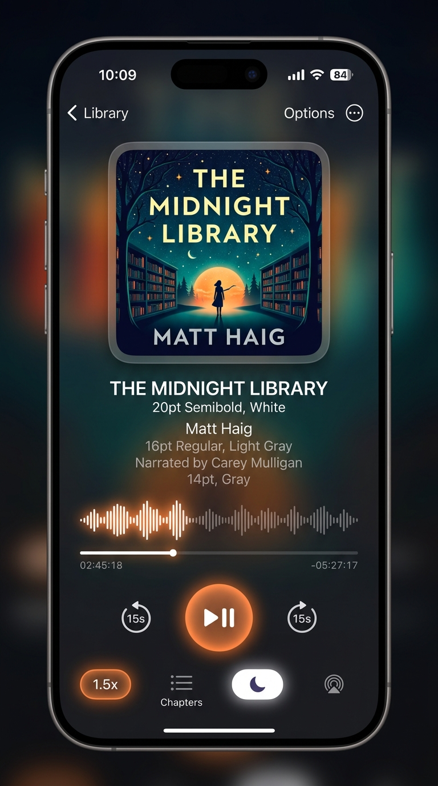
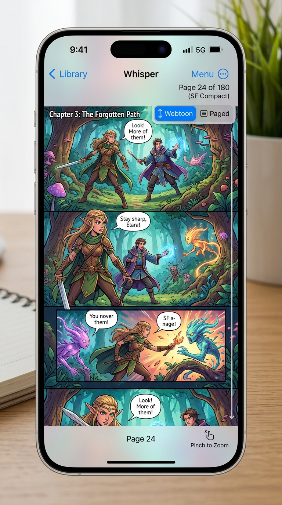

<div align="center">

  

  # Whisper

  **A clean, fast, native reader for your books, comics, and audiobooks.**  
  *Built with SwiftUI, SwiftData, and zero tracking.*

  [](https://developer.apple.com)
  [](https://swift.org)
  [](WhisperTests)
  [](LICENSE)

  <br />

  <table>
    <tr>
      <td align="center" width="50%">
        
        <br />
        <sub><b>Library</b> — Filter by format, track reading percentage, quick search</sub>
      </td>
      <td align="center" width="50%">
        
        <br />
        <sub><b>Reader</b> — Warm sepia paper theme, custom fonts & AI passage glow</sub>
      </td>
    </tr>
    <tr>
      <td align="center" width="50%">
        
        <br />
        <sub><b>Audiobooks</b> — Waveform scrubber, chapter jumps, sleep timer</sub>
      </td>
      <td align="center" width="50%">
        
        <br />
        <sub><b>Comics & Manga</b> — Flip pages or scroll vertically in Webtoon mode</sub>
      </td>
    </tr>
  </table>

</div>

---

### Why I built Whisper

I got tired of having four different reading apps on my phone and iPad.

One app for EPUBs, another for PDF papers, a comic reader for manga (CBZ), and a separate player for audiobooks. Almost every modern reader is either bloated with account signups and subscription popups, or built with sluggish web-view wrappers that stutter whenever you open a large book.

I wanted something simple:
1. **One native app** that opens my files without complaining about format.
2. **Instant startup** and butter-smooth scrolling.
3. **No cloud accounts, telemetry, or analytics**. Just local files that sync using my own iCloud or Google Drive.
4. **On-device smarts** so I can search by concept when I don't remember the exact quote.

That is what Whisper is.

---

### What it can do

#### 📖 Read almost anything
* **EPUB 2 & 3**: Streaming extraction so 50MB+ books don't hang the UI. You can read in continuous vertical scroll or classic paginated edge-tap mode.
* **PDFs**: Powered by native `PDFKit`. Full table of contents outline, smooth pinch-to-zoom, and search that actually scrolls to and highlights the matching sentence on the page.
* **Comics & Manga (`.cbz`, `.cbr`)**: Unpacks images on the fly with low memory usage. You can flip pages horizontally or switch to **Webtoon mode** for seamless vertical scrolling with dynamic zoom.
* **Plain Text & Markdown**: Minimalist reading with auto-detected `#` headings, paragraph indexing, and comfortable line spacing.
* **Audiobooks (`.m4b`, `.mp3`, `.m4a`, `.aac`)**: Built-in player with waveform scrubbing, 15-second skip buttons, chapter cue extraction, speed adjustments (0.75x–2.0x), sleep timer, and background playback with lock screen controls.

#### 🧠 Smart Find (Semantic search without the cloud)
Ever tried searching a 900-page book for a scene you remember, but you can't recall the exact wording? 
Whisper uses Apple's built-in **Natural Language (`NLEmbedding`)** model right on your device:
* Type a concept like *"escape from the fortress"* or *"discussion about the ancient map"*.
* It scans paragraphs locally and ranks them by meaning.
* Tapping a search result jumps straight to that exact chapter, page, or audio timestamp, and highlights the passage with a gentle golden glow for a couple seconds so you can see where you are.
* It also extracts a **Dramatis Personae** (character list) so you can review who is who in a complex story.

#### 📷 Physical Book Scanner
If you are reading a physical paperback and want to save pages to your digital library:
* Point your camera at the page.
* It uses Apple's Vision OCR to recognize the text, clean up line breaks, and let you either generate a new EPUB or append the scan as a new chapter to an existing book.

#### ☁️ Simple Cloud Sync
* **iCloud Drive**: Works out of the box. Automatically triggers downloads if files are stored as `.icloud` dataless stubs so the reader never freezes.
* **Google Drive**: Pure REST client without third-party Google SDKs. Link your account and sync your library folder directly.
* **Battery-friendly**: Reading positions are debounced and synced when you pause reading or leave the app, rather than bombarding network requests on every scroll.

#### 🎨 Reading Themes
Four calibrated color themes designed for real-world lighting:
* **Paper White** — Clean, neutral daylight reading.
* **Warm Sepia** — Soft amber hue that is easy on the eyes at night.
* **Midnight OLED** — Pure `#000000` background for OLED displays.
* **Forest Moss** — Muted dark sage tone for long study sessions.

---

### Siri & App Shortcuts

Whisper connects to Apple's **App Intents** framework, so you can control it with your voice or build automations in the Shortcuts app:

* *"Hey Siri, continue reading in Whisper"* — Resumes your last book or audiobook right where you stopped.
* *"Hey Siri, read Dune in Whisper"* — Jumps straight into that title.
* *"Hey Siri, what am I reading in Whisper?"* — Reads out your current title and progress.
* *"Hey Siri, bookmark this page in Whisper"* — Saves a bookmark without breaking your reading flow.
* *"Hey Siri, summarize book in Whisper"* — Generates an on-device synopsis of the current book.

---

### Keyboard Shortcuts (Mac & iPad)

| Key | What it does |
|---|---|
| `⌘F` | Open Smart Find |
| `⌘B` | Open Chapters & Bookmarks inspector |
| `⌘,` | Reading appearance & font settings |
| `⌘W` / `Esc` | Return to library |
| `Space` | Play / Pause audiobooks |
| `→` / `←` | Next / Previous page or chapter |

---

### Project Structure

```
Whisper/
├── Design/           # Design system tokens, glass modifiers, and liquid backgrounds
├── Helpers/          # MiniZip streaming extractor, ImageCache, WebKitWarmer
├── Intents/          # AppEntity & AppShortcuts for Siri and Spotlight
├── Models/           # Book, Bookmark, and AppTheme (SwiftData)
├── Services/
│   ├── AudiobookPlayerService.swift # AVFoundation player with lock screen Now Playing
│   ├── ChapterService.swift         # Universal TOC extractor (EPUB, PDF, CBZ, TXT, Audio)
│   ├── CloudSyncService.swift       # iCloud sync & dataless file downloader
│   ├── GoogleDriveSyncService.swift # REST-based Google Drive sync
│   ├── TypeSafeService.swift        # On-device NLEmbedding semantic search
│   └── EpubGeneratorService.swift   # Camera OCR text to EPUB synthesizer
├── ViewModels/       # LibraryViewModel, ReaderViewModel
└── Views/            # Format readers (Epub, PDFKit, Comic, Text, Audiobook) and UI sheets
```

---

### How to build and run

1. Make sure you have **Xcode 16.0+** and a Mac running **macOS 15.0+**.
2. Clone this repo:
   ```bash
   git clone https://github.com/AnuragAmbuj/whisper.git
   cd whisper
   ```
3. Open `Whisper.xcodeproj` in Xcode.
4. Select your device or simulator and hit **⌘R** to build and run.
5. Hit **⌘U** to run the test suite (54/54 unit & UI tests pass).

---

### Privacy

There are no trackers, third-party advertising SDKs, or remote servers collecting data. Your books stay on your device and inside your own personal iCloud / Google Drive accounts. All AI summaries and semantic searches run locally on Apple's Neural Engine.

---

### License

Whisper is open source under the [MIT License](LICENSE). Contributions, bug reports, and pull requests are very welcome!
