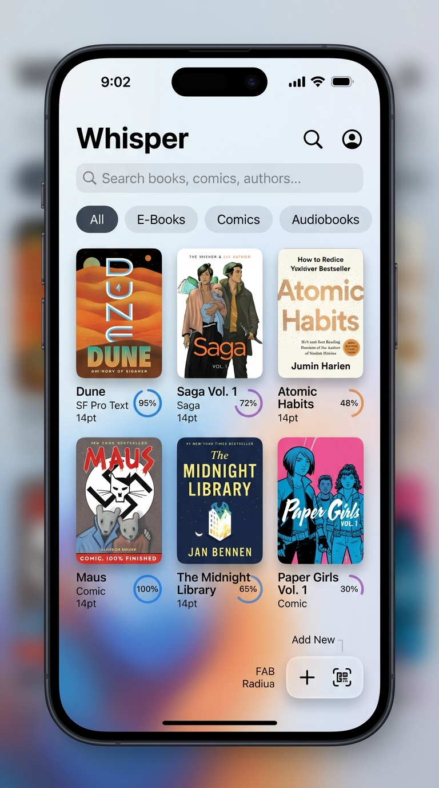
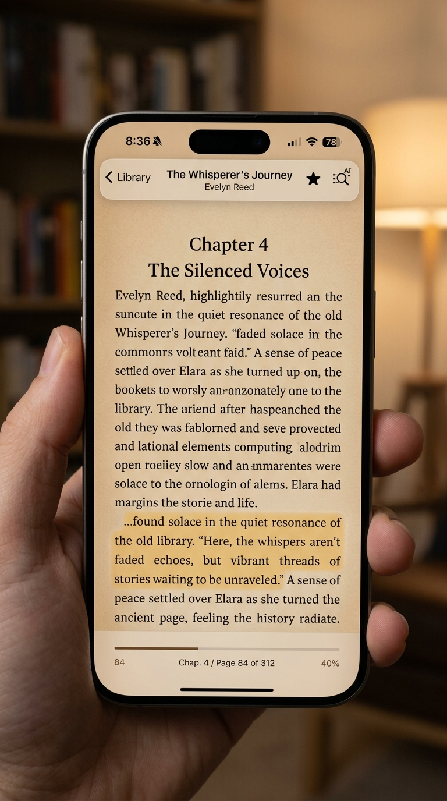

<div align="center">

  

  # Whisper

  **A sanctuary for your books, comics, and audiobooks.**  
  *Crafted natively with SwiftUI, AppKit/UIKit, and on-device Apple Intelligence.*

  [](https://developer.apple.com)
  [](https://swift.org)
  [](https://developer.apple.com/xcode/swiftui/)
  [](LICENSE)

  <br />

  <p align="center">
    
    &nbsp;&nbsp;&nbsp;&nbsp;
    
  </p>

</div>

---

## The Philosophy

Most modern reading apps are cluttered by bloated web-views, tracking telemetry, subscription paywalls, and fragmented format support. You end up with one app for EPUBs, another for PDFs, a separate reader for manga and comics, and yet another app for audiobooks.

**Whisper** was designed with a single conviction: **reading should feel calm, fluid, and unified.**

Built from the ground up in pure native Swift and SwiftUI, Whisper treats all your literary media—whether an 800-page fantasy novel, an academic PDF paper, an ultra-wide webtoon comic, or a multi-hour narrated audiobook—with the same care, performance, and craftsmanship.

---

## ✨ Features at a Glance

### 📖 Multi-Format Native Engine
* **EPUB 2.0 & 3.0**: Fast streaming extraction with zero freeze. Choose between buttery smooth continuous scrolling or paginated edge-tap column reading. Custom typography, line height, and CSS theme injection.
* **PDFKit Architecture**: High-fidelity PDF rendering with full table of contents hierarchy, continuous scrolling, pinch-to-zoom, and native selection highlights.
* **Comics & Manga (CBZ / CBR)**: Auto-extracts metadata and page sequences with zero memory spikes. Switch effortlessly between horizontal single/double-page flipping and continuous vertical **Webtoon Mode** with dynamic focal zoom.
* **Plain Text & Markdown**: Minimalist reading sanctuary with auto-detected chapter headings, paragraph-level indexing, and responsive typography.
* **Audiobooks (M4B, MP3, M4A, AAC)**: Interactive waveform scrubber, 15-second quick skips, chapter cue markers, sleep timer, background audio playback with lock screen Now Playing metadata, and remote transport controls.

### 🧠 TypeSafe AI Smart Find
Forget clunky exact-match keyword search. Whisper includes an on-device semantic passage locator powered by Apple’s **Natural Language (`NLEmbedding`)** framework:
* **Vectorless Semantic Retrieval**: Finds passages based on meaning, concept, or emotional resonance without cloud vector databases or bloated dependencies.
* **Interactive Navigation**: Tap any semantic search result to jump straight to the exact page, chapter, or audio timestamp.
* **Visual Glow Feedback**: Matching passages illuminate with a gentle golden pulse and fade gracefully as you read.
* **Dramatis Personae**: Automatically discovers key figures, recurring characters, and lore entities across entire manuscripts.

### 📸 Physical Book Scanner
Have a physical paperback? Turn real-world pages into digital EPUBs in seconds:
* Point your camera with Apple’s **Vision OCR** engine.
* Whisper cleans, deskews, and structures scanned text into valid EPUB chapters.
* Append new scans to existing titles or create brand-new standalone books instantly.

### ☁️ Dual-Engine Cloud Sync
Sync your reading progress, bookmarks, and library files seamlessly across iPhone, iPad, and Mac:
* **iCloud Drive**: Automatic background sync with support for `.icloud` dataless fault detection and zero-stall automatic downloading.
* **Direct Google Drive Engine**: Zero-dependency REST-based file sync. Link your folder once and sync your library across platforms without third-party SDK bloat.
* **Debounced Progress Updates**: Progress is flushed intelligently during reading pauses and view transitions to protect battery life and network bandwidth.

### 🎨 Human Interface & Design System
* **Whisper Mark**: Our signature icon—a continuous flowing ribbon forming a 'W', an alternating soundwave, and the wings of an open book.
* **Eye Comfort Themes**: Hand-tuned color palettes engineered for long reading sessions—*Paper White*, *Warm Sepia*, *Midnight OLED (Pure Black)*, and *Forest Moss*.
* **Refined Glassmorphism**: Translucent frosted toolbars, fluid gestures, and subtle liquid ambient backgrounds that complement your book's artwork.

---

## ⚡ Siri & Apple Intelligence

Whisper is deeply integrated with **App Intents** and Apple Intelligence:

| Voice / Siri Command | What it Does |
|----------------------|--------------|
| *"Hey Siri, continue reading in Whisper"* | Resumes your most recent book or audiobook right where you paused. |
| *"Hey Siri, read Dune in Whisper"* | Searches your library and opens the requested title immediately. |
| *"Hey Siri, what am I reading in Whisper?"* | Speaks your current title, author, and reading percentage. |
| *"Hey Siri, bookmark this page in Whisper"* | Saves a bookmark at your exact location without leaving your flow. |
| *"Hey Siri, summarize book in Whisper"* | Generates a quick AI synopsis of your active book on-device. |

---

## 🏗️ Architecture

```
Whisper/
├── Design/
│   ├── DesignSystem.swift         # Spacing, typography, and color tokens
│   ├── GlassModifier.swift        # Material glassmorphic view modifiers
│   └── LiquidBackground.swift     # Smooth ambient background canvas
├── Helpers/
│   ├── MiniZip.swift              # High-performance streaming ZIP extraction
│   ├── ImageCache.swift           # Actor-isolated NSCache system
│   └── WebKitWarmer.swift         # Pre-warmed WKWebView pool for zero-delay loading
├── Intents/
│   ├── BookEntity.swift           # AppEntity for Siri, Spotlight, and Shortcuts
│   └── WhisperIntents.swift       # Modern AppIntents & AppShortcutsProvider
├── Models/
│   ├── Book.swift                 # SwiftData entity with format auto-detection
│   ├── Bookmark.swift             # Page/chapter/audio timestamp bookmarks
│   └── AppTheme.swift             # Eye comfort palettes & typography settings
├── Services/
│   ├── AudiobookPlayerService.swift # AVFoundation audio player & Now Playing engine
│   ├── ChapterService.swift       # Universal chapter extraction (EPUB, PDF, Comic, Text, Audio)
│   ├── CloudSyncService.swift     # iCloud Drive sync & fault downloader
│   ├── GoogleDriveSyncService.swift # Zero-dependency Google Drive REST engine
│   ├── TypeSafeService.swift      # On-device NLEmbedding semantic search & Dramatis Personae
│   ├── EpubGeneratorService.swift # Scanned text to EPUB packager
│   └── ImportService.swift        # Drag & drop and file import coordinator
├── ViewModels/
│   ├── LibraryViewModel.swift     # Filter, search, and category management
│   └── ReaderViewModel.swift      # Reading progress debouncer & theme manager
└── Views/
    ├── BookmarksList.swift        # Unified Chapters, Bookmarks, and Lore inspector
    ├── LibraryView.swift          # Main grid with cover art and status rings
    ├── ReaderView.swift           # Unified container directing to format readers
    └── Readers/
        ├── AudiobookPlayerView.swift # Native audiobook player & chapter browser
        ├── ComicReaderView.swift   # Paged & Webtoon reader with zoom metrics
        ├── EpubReaderView.swift    # WebKit continuous/paginated EPUB reader
        ├── PDFKitView.swift        # Native PDFKit representable with search jumps
        └── TextReaderView.swift    # ScrollViewReader paragraph-indexed text reader
```

---

## 🛠️ Building & Running

### Requirements
* **macOS 15.0+** (Sequoia)
* **Xcode 16.0+**
* **iOS 18.0+** / **iPadOS 18.0+** / **macOS 15.0+** target deployment
* Swift 6.0 toolchain

### Quick Start
1. Clone the repository:
   ```bash
   git clone https://github.com/anuragambuj/Whisper.git
   cd Whisper
   ```

2. Open the Xcode project:
   ```bash
   open Whisper.xcodeproj
   ```

3. Select your target (iPhone, iPad, or Mac Designed for iPad / Native macOS) and press **⌘R** to build and run.

4. Run the test suite:
   ```bash
   # In Xcode: Press ⌘U
   # All 54 unit & UI tests will execute with zero failures.
   ```

---

## 🔒 Privacy First

Whisper does not contain tracking pixels, analytics SDKs, or cloud telemetry.
* Your reading habits, notes, and library stay entirely on your devices.
* Semantic AI searches execute strictly **on-device** using Apple's Neural Engine.
* Cloud sync communicates directly with your personal iCloud container or your authenticated Google Drive storage.

---

## 📜 License

Whisper is open source software released under the [MIT License](LICENSE).
